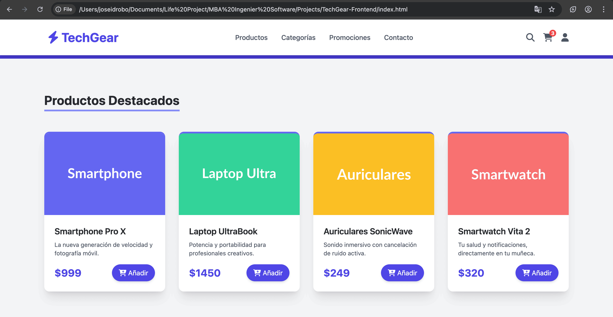
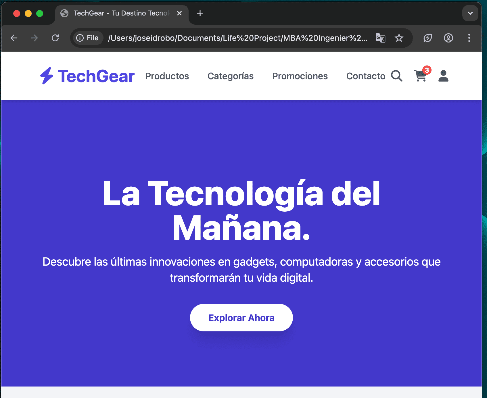
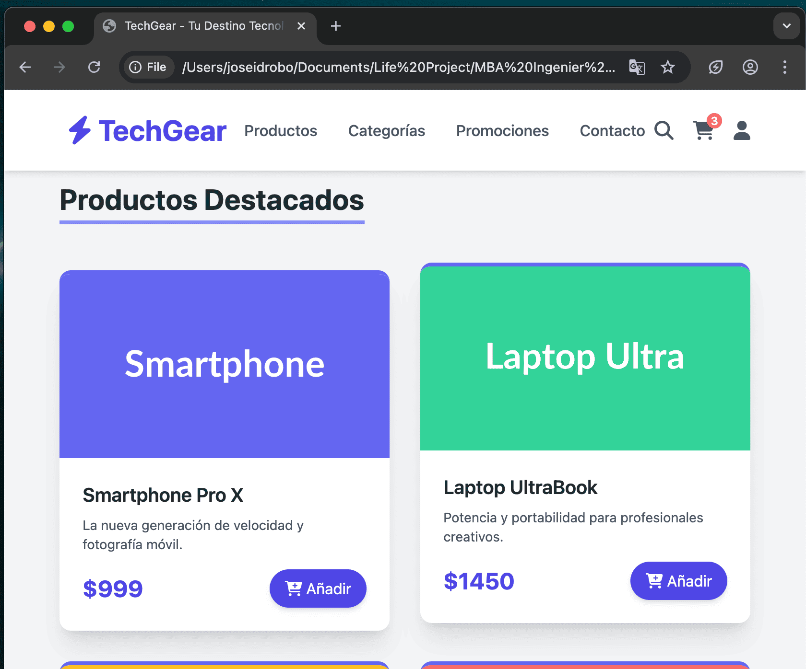
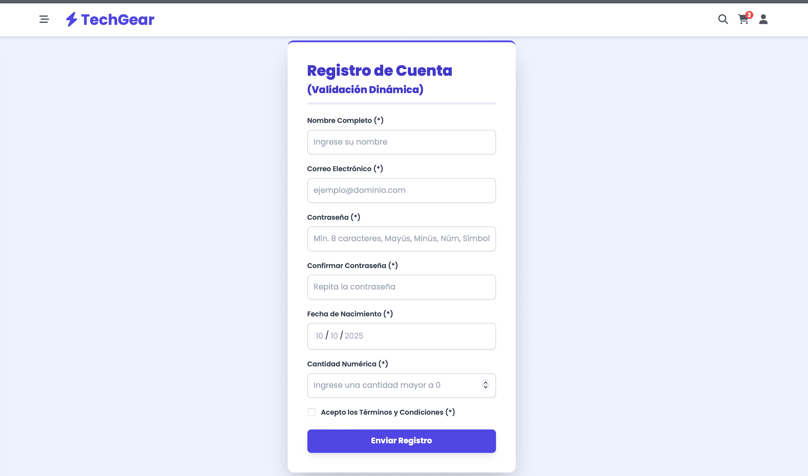
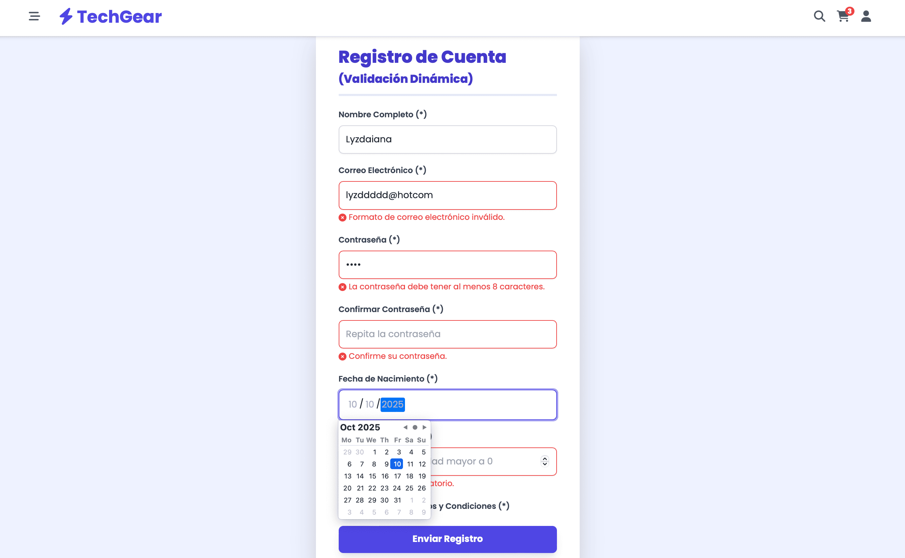
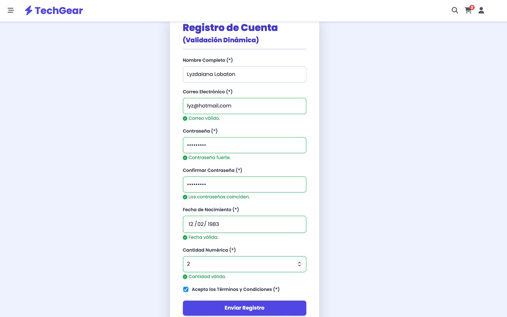

# TechGear "E-commerce"
Es una maqueta inicial de un proyecto de comercio electrónico diseñado para la venta de productos tecnológicos. _"facilitando a los usuarios navegar por un catálogo de productos, agregarlos al carrito de compras, gestionar sus pedidos y realizar pagos de forma segura"_. 

_**Maqueta:**_ _mediante la cual, se demuestra el dominio de **HTML5, CSS3 avanzado y TailwindCSS**, aplicando principios de diseño responsivo, interactividad y estética moderna_.

**_Características Principales_**

- _Catálogo de Productos: Estructura semántica (article) para presentar productos con precios y botones de "Añadir al Carrito"._
- _Diseño Responsivo: Compatibilidad con dispositivos móviles, tabletas y escritorios._
- _Usabilidad y Estética: Uso de Tailwind CSS para un diseño limpio y moderno con transiciones suaves._
- _Estructura Semántica: Implementación de etiquetas semánticas (header, main, section, article, footer)._

## 🛠️ Tecnologías y Herramientas Utilizadas

- _HTML5 y CSS3 --> (Estructura y Diseño)_
- _Tailwind, CSS y JavaScript --> (Framenwork y Comportamiento)_

## Estructura del proyecto - TechGear

/techgear-frontend/

├── assets/ --> .png

├── css/     
     - style.css

├── js/    
     - script.js   
     
├── index.html  
└── README.md  

------------------ // --------------------------

### 📸 Demostración Responsive

**_View en web_**

**_View en tablet_**

**_View en mobile_**

------------------ // --------------------------

### 🚧 Desafío

Los principales desafíos técnicos abordados se centran en la eficiencia y la inicialización de librerías en un entorno de producción _(inicialización del Canvas, Sincronización del DOM y Preparación de Tailwind para Producción)_

### ⚙️ Instalación y Uso

- _Clonar el Repositorio (en GitHub)_

   git clone [URL-DEL-REPOSITORIO]

- _Abrir el Archivo:_
   Simplemente abre el archivo index.html en tu navegador web preferido.

   _Nota: La animación 3D utiliza la librería Three.js, la cual se carga a través de un CDN, por lo que no necesitas ninguna instalación adicional_.

### Capturas de los estados clave del formulario.

**_Estado Inicial (Vacío)_**
 _Muestra el formulario sin llenar los campos, revelando todos los mensajes de error de campos requeridos._

**_Estado de Validación con Errores Específicos_**
_Muestra cómo el formulario detecta errores basados en reglas (REGEX, lógica, etc.), como un email no válido o una contraseña débil._

**_Estado Ok (Listo para Enviar)_**
_Muestra el formulario completamente lleno con datos válidos, listo para ser procesado._

_Nota: este estado final confirma que todos los datos cumplen con los requisitos del sistema, ofreciendo una retroalimentación positiva al usuario._

**📄 _Licencia_**

Este proyecto está bajo la Licencia MIT.