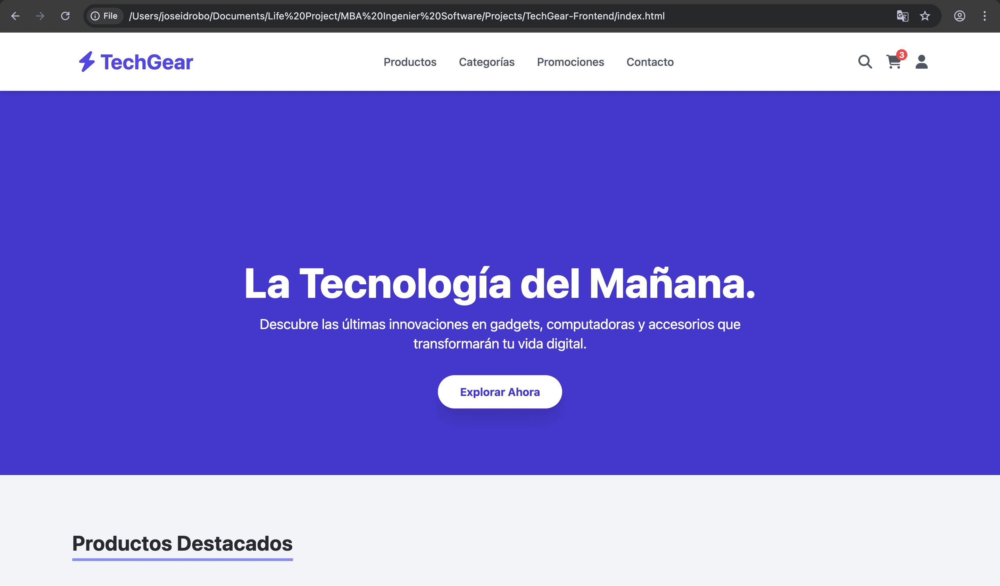
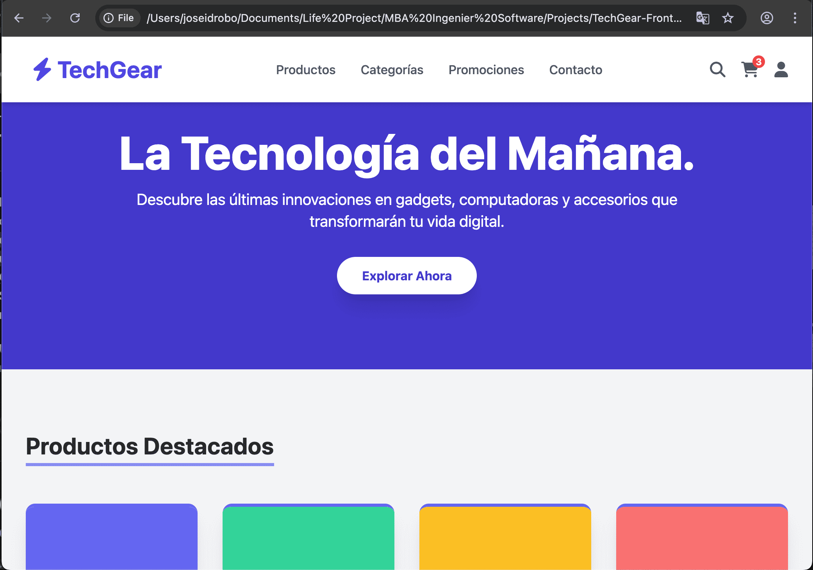
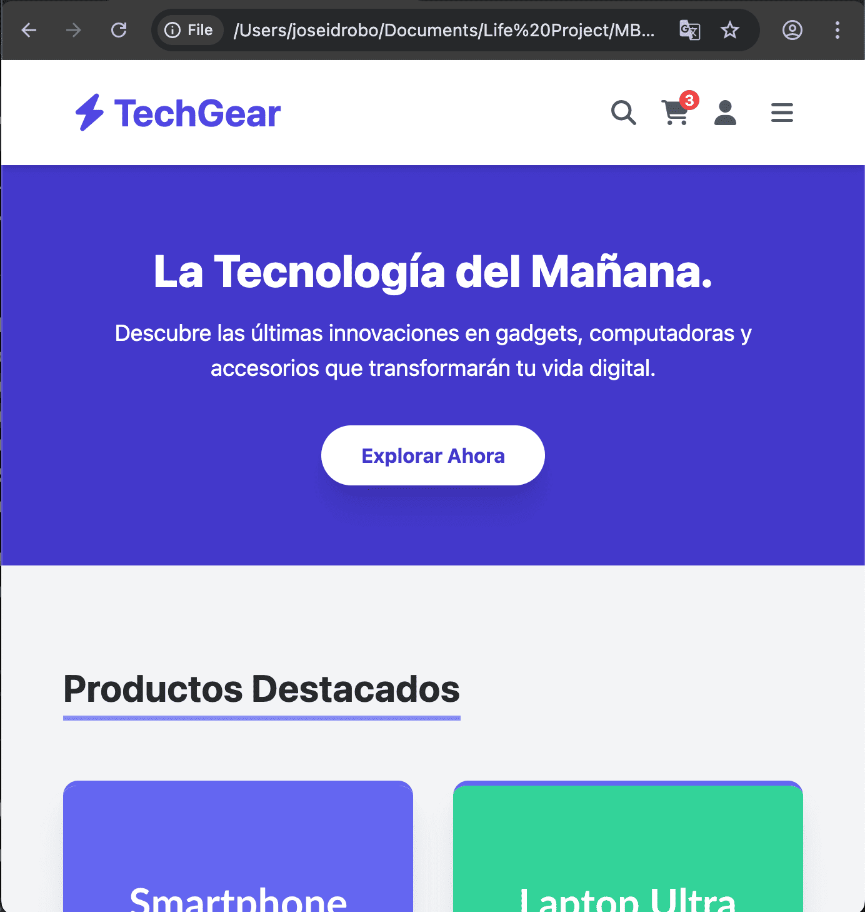

# TechGear "E-commerce"
Es una maqueta inicial de un proyecto de comercio electrónico diseñado para la venta de productos tecnológicos. _"facilitando a los usuarios navegar por un catálogo de productos, agregarlos al carrito de compras, gestionar sus pedidos y realizar pagos de forma segura"_. 

_**Maqueta:**_ _mediante la cual, se demuestra el dominio de **HTML5, CSS3 avanzado y TailwindCSS**, aplicando principios de diseño responsivo, interactividad y estética moderna_.

**_Características Principales**_

- _Catálogo de Productos: Estructura semántica (<article>) para presentar productos con precios y botones de "Añadir al Carrito"._
- _Diseño Responsivo: Compatibilidad con dispositivos móviles, tabletas y escritorios._
- _Usabilidad y Estética: Uso de Tailwind CSS para un diseño limpio y moderno con transiciones suaves._
- _Estructura Semántica: Implementación de etiquetas semánticas (<header>, <main>, <section>, <article>, <footer>)._

## 🛠️ Tecnologías y Herramientas Utilizadas

- _<HTML5>, <CSS3>(Estructura y Diseño)_
- _<Tailwind> <CSS> y <JavaScript> (Framenwork y Comportamiento)_

## Estructura del proyecto - TechGear

/techgear-frontend/
├── assets/  <-- Contenido estático (imágenes, fuentes, etc.)
├── css/     <-- Estilos
│   └── style.css
├── js/      <-- Lógica JavaScript
│   └── script.js
├── index.html  <-- Punto de entrada principal
└── README.md   <-- Documentación

### Screenshots de la página web en diferentes tamaños de pantalla 

**_View en web**_

**_View en tablet**_

**_View en mobile**_

------------------ // --------------------------

## ⚙️ Instalación y Uso

- _Clonar el Repositorio (en GitHub)_

   git clone [URL-DEL-REPOSITORIO]

- _Abrir el Archivo:_
   Simplemente abre el archivo index.html en tu navegador web preferido.

   _Nota: La animación 3D utiliza la librería Three.js, la cual se carga a través de un CDN, por lo que no necesitas ninguna instalación adicional_.