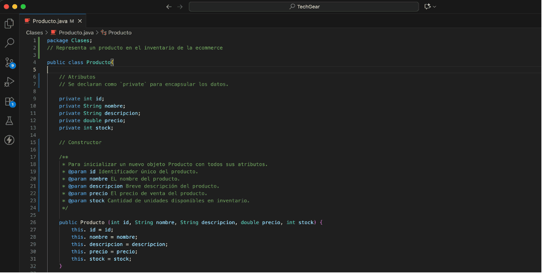

# TechGear "E-commerce"

Es un proyecto de comercio electrónico diseñado para la venta de productos tecnológicos. _"facilitando a los usuarios navegar por un catálogo de productos, agregarlos al carrito de compras, gestionar sus pedidos y realizar pagos de forma segura"_. 

_**El objetivo principal:**_ _es ofrecer una experiencia de compra fluida y eficiente, con una interfaz intuitiva y un backend robusto_.

En ese sentido, la propuesta del presente proyecto se centra en el diseño arquitectónico de **"TechGear"**, _una plataforma de que busca abordar los desafíos clave de este nicho, la compatibilidad y necesidad del cliente_.
## 🛠️ Tecnologías y Herramientas Utilizadas

El proyecto contempla un conjunto de tecnologías y herramientas que garantizan su funcionalidad, escalabilidad y seguridad.

**FrontEnd:** 
- _HTML5, CSS3 y 
- _XXXXXX
- _XXXXXX
 

### _=== FrontEnd ===_

## Maqueta de Plataforma eCommerce - TechGear
Contiene la maqueta inicial de la página web para la plataforma de eCommerce **TechGear** donde el uso de tecnologías para web modernas como HTML5, CSS3 y Tailwind CSS permite crear una interfaz de usuario atractiva, interactiva y responsiva.

