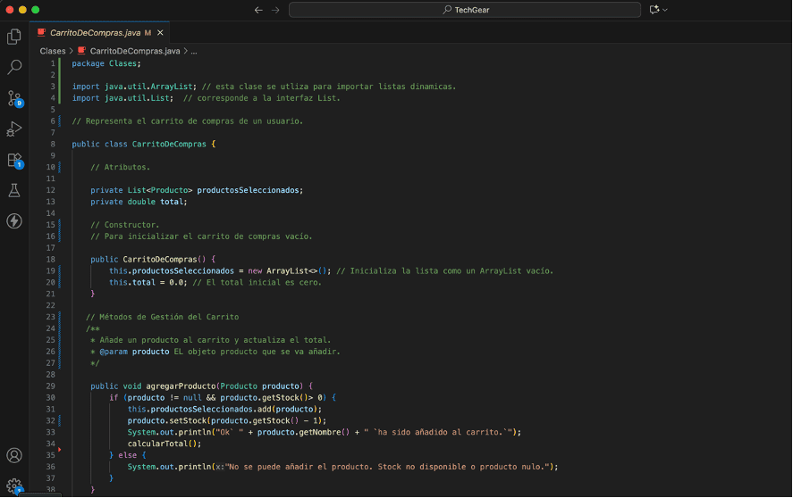
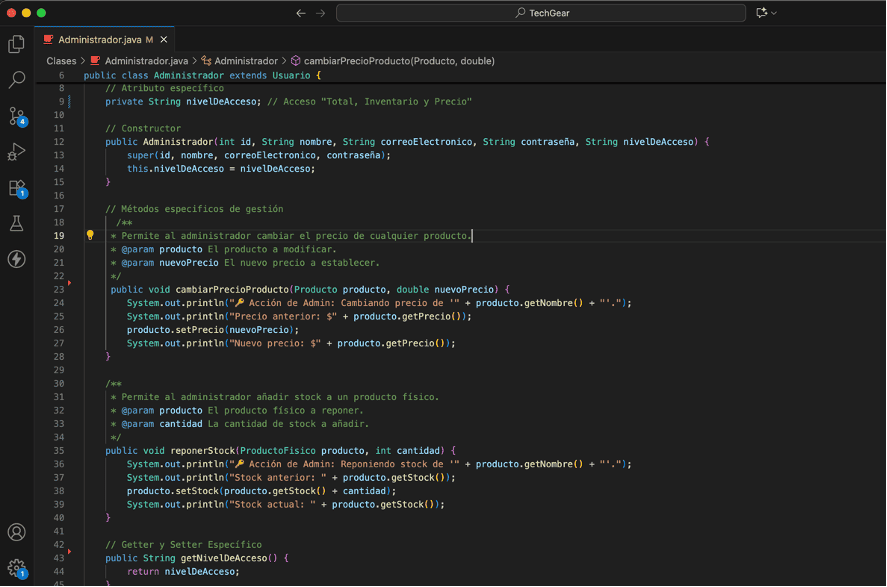
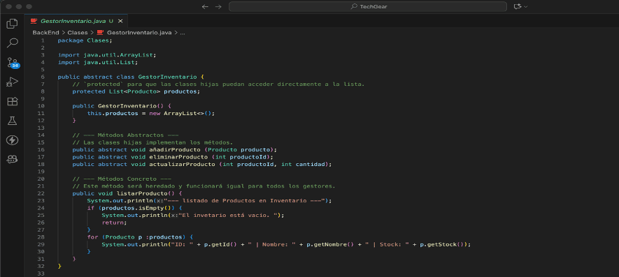

# TechGear "E-commerce"
Es una maqueta inicial de un proyecto de comercio electrónico diseñado para la venta de productos tecnológicos. _"facilitando a los usuarios navegar por un catálogo de productos, agregarlos al carrito de compras, gestionar sus pedidos y realizar pagos de forma segura"_. 

_**Maqueta:**_ _mediante la cual, se demuestra el dominio de **HTML5, CSS3 avanzado y TailwindCSS**, aplicando principios de diseño responsivo, interactividad y estética moderna_.

**_Características Principales_**

- _Catálogo de Productos: Estructura semántica (article) para presentar productos con precios y botones de "Añadir al Carrito"._
- _Diseño Responsivo: Compatibilidad con dispositivos móviles, tabletas y escritorios._
- _Usabilidad y Estética: Uso de Tailwind CSS para un diseño limpio y moderno con transiciones suaves._
- _Estructura Semántica: Implementación de etiquetas semánticas (header, main, section, article, footer)._

## 🛠️ Tecnologías y Herramientas Utilizadas

- _HTML5 y CSS3 --> (Estructura y Diseño)_
- _Tailwind, CSS y JavaScript --> (Framenwork y Comportamiento)_

## Estructura del proyecto - TechGear

/techgear-frontend/

├── assets/ --> .png

├── css/     
     - style.css

├── js/    
     - script.js   
     
├── index.html  
└── README.md  

------------------ // --------------------------

### 📸 Demostración Responsive

**_View en web_**

**_View en tablet_**

**_View en mobile_**

------------------ // --------------------------

### 🚧 Desafío

Los principales desafíos técnicos abordados se centran en la eficiencia y la inicialización de librerías en un entorno de producción _(inicialización del Canvas, Sincronización del DOM y Preparación de Tailwind para Producción)_

### ⚙️ Instalación y Uso

- _Clonar el Repositorio (en GitHub)_

   git clone [URL-DEL-REPOSITORIO]

- _Abrir el Archivo:_
   Simplemente abre el archivo index.html en tu navegador web preferido.

   _Nota: La animación 3D utiliza la librería Three.js, la cual se carga a través de un CDN, por lo que no necesitas ninguna instalación adicional_.

### Capturas de los estados clave del formulario.

**_Estado Inicial (Vacío)_**
 _Muestra el formulario sin llenar los campos, revelando todos los mensajes de error de campos requeridos._

**_Estado de Validación con Errores Específicos_**
_Muestra cómo el formulario detecta errores basados en reglas (REGEX, lógica, etc.), como un email no válido o una contraseña débil._

**_Estado Ok (Listo para Enviar)_**
_Muestra el formulario completamente lleno con datos válidos, listo para ser procesado._

_Nota: este estado final confirma que todos los datos cumplen con los requisitos del sistema, ofreciendo una retroalimentación positiva al usuario._

### Convertir el frontend de la Plataforma en una SPA con AngularJS - Migración
Estructura a implementar para realizada la migración de React a AngularJS

techgear-frontend/
│
├── archived-react/
│   └── src-react-legacy/         # React antiguo (respaldo)
│
├── techgear-admin/               # Proyecto Angular
│   ├── angular.json
│   ├── package.json
│   ├── src/
│   │   ├── app/
│   │   │   ├── components/
│   │   │   │   ├── product-list/
│   │   │   │   ├── product-form/
│   │   │   ├── services/
│   │   │   ├── app.config.ts
│   │   │   ├── app.routes.ts
│   │   │   ├── app.ts
│   │   │   └── app.html
│   │   ├── index.html
│   │   └── main.ts
│   ├── tsconfig.json
│   ├── package-lock.json
│   └── node_modules/
│
├── README.md
└── db.json                      # Para JSON Server (API falsa)

_**Pasos para acceder a la e-commerce**_

_Levantar JSON Server:  terminal 1_

- Paso 1: cd "/Users/joseidrobo/Documents/Life Project/MBA Ingenier Software/Projects/techgear-frontend/techgear-admin"
- Paso2: npx json-server --watch ../db.json --port 3001

_Ejecuta Angular:  teminal 2_

- Paso1: cd "/Users/joseidrobo/Documents/Life Project/MBA Ingenier Software/Projects/techgear-frontend/techgear-admin"
- Paso2: ng serve –open. → http://localhost:4200/

**Resultado Obtenido** 
Ir: http://localhost:3001/products → lista de productos en formato JSON

Luego ir : http://localhost:4200/ → La interfaz “TechGear” en Angular → cargar correctamente

_migración al 90% - Angular JS (formularios sin cargar)_

### _===++++ BackEnd +++++++===_

## Clases
La implementación de las clases **“Producto, Usuario y CarritoDeCompra”** es clave para el correcto funcionamiento de la e-commerce, ya que encapsulan la información de los artículos, los compradores y la gestión de los productos seleccionados respectivamente, formando la base de la lógica de **"TechGear”**.

### _Extensión de Funcionalidades mediante Herencia_
Permite una gestión organizada, reutilización de código y una extensión flexible del sistema a medida que la e-commerce crece, optimizando la forma en que los “productos, clientes y el proceso de compra se manejan de forma estructurada y modular”.

_El administrador tendrá permisos especiales, como la capacidad de modificar productos directamente en el inventario._

## Aplicación de Polimorfismo y Sobrecarga
La implementación de polimorfismo y sobrecarga permite manejar diversas operaciones sobre productos y pedidos en la plataforma "TechGear”.

_La sobreescritura de métodos permite que una clase hija proporcione una implementación específica para un método que ya está definido en su clase padre._

_Sobrecarga de Métodos agregarProducto () en la clase CarritoDeCompras._

#### _Implementación de Polimorfismo_ 

_Al procesar objetos de diferentes clases a través de una única interfaz. Dado a que ProductoFisico y ProductoDigital son Producto, se pueden tratar a todos por igual._

_En ese sentido se crea una Clase principal llamada **(Store.java)** que simula el funcionamiento de la e-commerce **"TechGear”**, La cual, instancian los objetos y se demuestra la interacción entre ellos, aplicando polimorfismo, herencia, sobrecarga y sobreescritura._

## Aplicación de Encapsulamiento y Abstracción
Permite ocultar la complejidad interna de un objeto (encapsulamiento) y presentar solo las características esenciales de manera simplificada (abstracción).

## Implementación de Interfaces y Clases Abstractas
Permiten definir qué deben hacer las clases (interfaces) o qué pueden heredar y completar las (clases abstractas), haciendo que el código sea más flexible y manejable.

#### _Interfaces_ 

## Implementación de Patrones de Diseño Singleton, Factory, y Observer
Son herramientas fundamentales en el desarrollo de software que resuelven problemas comunes de forma reutilizable y organizada. El Singleton asegura que una clase solo tenga una instancia, el patrón Factory abstrae la creación de objetos, “permitiendo una generación flexible de instancias sin especificar la clase exacta”. 

#### _Observer para notificaciones_

## Implementación de Manejo de Excepciones y Pruebas Unitarias
Facilitan la creación de software robusto, confiable y de calidad, permitiendo a los desarrolladores detectar y corregir errores de forma temprana, mejorar la experiencia del usuario al anticipar fallos inesperados y mantener la integridad del código a lo largo del tiempo. 

#### _Excepciones_

#### _Excepciones en la Lógica de Negocio (throw)_

### Prueba Unitarias (JUnit)
Las pruebas unitarias validan que cada "unidad" de código (cada método) funcione como se espera, tanto en casos de éxito como de error.

## Análisis del Proyecto
_"Desafíos, Aciertos y Mejoras"_

**📄 _Licencia_**

Este proyecto está bajo la Licencia MIT.